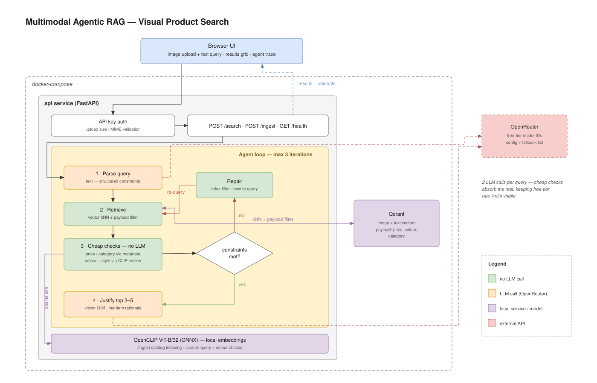

# Visual Product Search

Multimodal agentic RAG over a product catalogue. You give it an image, a description, or both
("like this but cheaper, in blue") and an agent loop retrieves, checks its own results against
your constraints, repairs the query when they fall short, and explains what it picked.



## How it works

1. **Parse** — an LLM turns the request into structured constraints (category, colour, budget).
2. **Retrieve** — CLIP embedding, vector kNN in Qdrant with price/category filters applied server side.
3. **Check** — price and category from metadata, colour and style from CLIP cosine similarity. No LLM.
4. **Repair** — if too few survive, relax the price ceiling, then the colour, then the category, and retry (max 3 passes).
5. **Justify** — a vision LLM ranks the survivors and writes one line per item.

Only steps 1 and 5 call an LLM. Everything else is embedding maths and metadata filtering, which
keeps the whole thing inside free-tier rate limits.

Embeddings run locally as ONNX (CLIP ViT-B/32 via fastembed) and are baked into the image, so no
embedding API is involved. Only the two LLM calls leave the machine.

## Running it

Requires Docker and an OpenRouter API key (free — https://openrouter.ai/keys).

```bash
cp .env.example .env      # add your key, change API_KEY
docker compose up --build
```

Then open http://localhost:8000.

The free model IDs in `.env.example` go stale as OpenRouter rotates them. Check
https://openrouter.ai/models?q=free and update `TEXT_MODELS` / `VISION_MODELS` if calls fail —
both accept a comma-separated list and are tried in order.

## Loading a catalogue

CSV with `title,price,image,category,colour` plus an image folder:

```bash
uv run python -m scripts.ingest data/catalogue.csv --images data/images
```

Or one item at a time via `POST /ingest`.

## Endpoints

| Method | Path | Notes |
| --- | --- | --- |
| POST | `/search` | `query` and/or `image`, returns ranked results + agent trace |
| POST | `/ingest` | single item, multipart |
| GET | `/health` | liveness |

`/search` and `/ingest` require an `X-API-Key` header matching `API_KEY`.

## Security notes

- API key compared with `secrets.compare_digest`, never logged
- uploads restricted to jpeg/png/webp and capped at 5 MB, enforced while reading rather than trusting `Content-Length`
- container runs as a non-root user
- `.env` is gitignored; `.env.example` carries no real secrets
- frontend builds result nodes with `textContent`, so catalogue text cannot inject markup

## Development

```bash
uv sync
uv run pytest
uv run uvicorn app.main:app --reload
```

Local runs need Qdrant reachable — `docker compose up qdrant` and set `QDRANT_URL=http://localhost:6333`.
