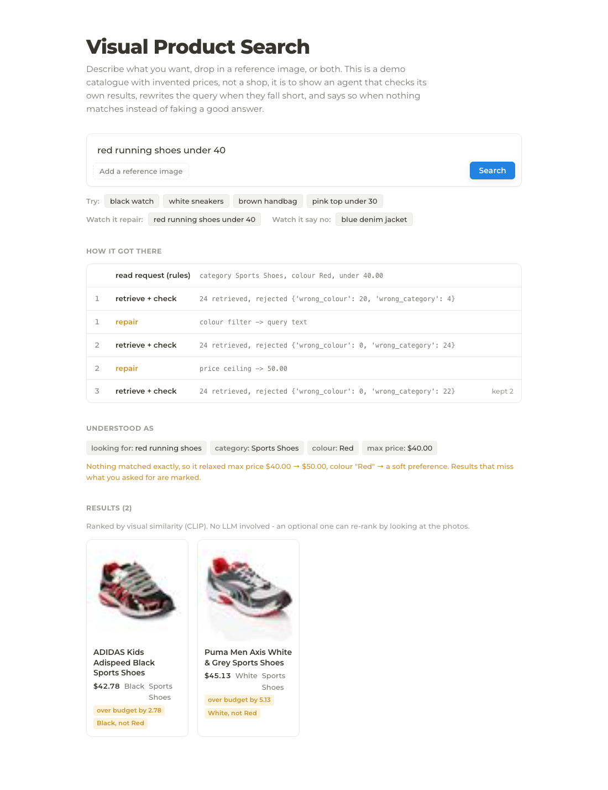
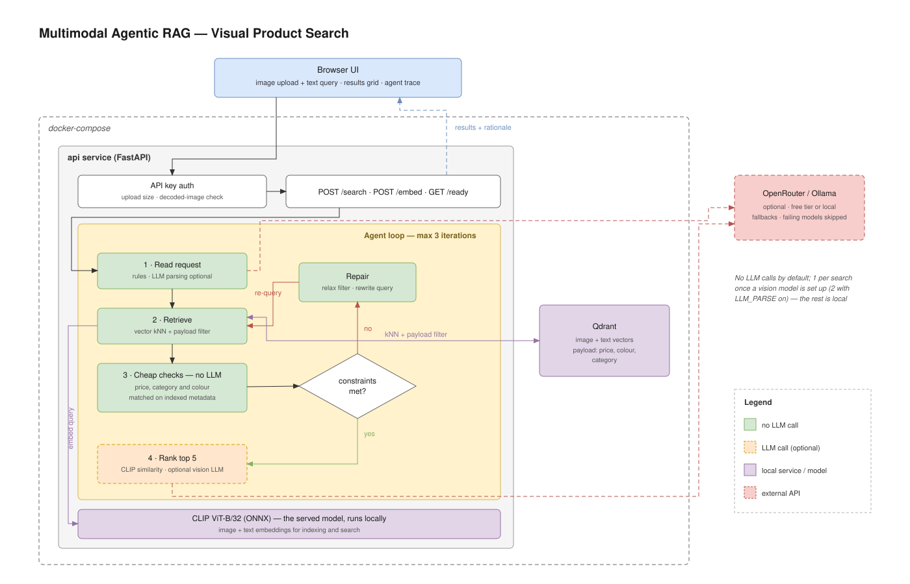

# Visual Product Search

Multimodal product search over a small fashion catalogue, served by FastAPI in Docker. Give it a
photo, a description or both ("like this but cheaper, in grey") and a search loop retrieves
candidates, checks them against the request, relaxes the query when they fall short and marks
anything that doesn't fully match.

The model is CLIP ViT-B/32 (public weights, ONNX via fastembed), baked into the image and run on
CPU, with Qdrant as the vector database. `POST /embed` serves it directly; `/search` runs the search
loop on top. No API keys or LLMs are needed.





## Running it

Needs Docker with Compose v2, and ports 8000 and 6333 free.

```bash
git clone https://github.com/Delocy/rdai-project.git
cd rdai-project
docker compose up --build
```

No `.env` is needed. To change the API key or the rate limit, `cp .env.example .env` and edit it
before building.

Open http://localhost:8000 once the log shows `Application startup complete`. The first run takes
longer: the build bakes in the CLIP weights, and the API indexes the 300 sample products before it
starts serving (20 seconds to a couple of minutes; the log counts them), and `docker compose ps`
then shows the api as healthy. The API docs are at http://localhost:8000/docs.
`docker compose down` stops it, and `docker compose down -v` also wipes the index.

## How it works

1. **Read**: rules pull out a budget ("under 40"), a colour and a category, using the catalogue's
   own labels plus a few everyday words (sneakers, tee).
2. **Match**: the category and colour become the catalogue labels they name, matched word by word
   ("Shirts" isn't "Tshirts"; "shoes" covers Casual, Sports and Formal Shoes).
3. **Retrieve**: CLIP embeds the text and/or photo, and Qdrant returns the 24 nearest products that
   pass the budget, category and colour filters, so a match anywhere in the catalogue is found,
   not only one among the nearest few.
4. **Repair**: with fewer than five matches, relax and retry, at most 3 passes: colour becomes a
   soft preference when dropping it brings in more products, then the budget widens 25%, and the
   category goes last. What was relaxed is reported, and misses are marked ("over budget by 4.50",
   "Black, not Red").
5. **Rank**: by visual similarity: Qdrant returns the nearest first, so the shortlist is already
   in CLIP order.

The UI streams each step as it happens. If nothing in the catalogue fits, it says so rather than
passing off the nearest photos as matches.

Colour checking started out as CLIP zero-shot classification. Measured on this catalogue it was
42% accurate, and an absolute cosine threshold separated blue from non-blue items barely at all
(0.175–0.227 against 0.162–0.219), because product shots on white backgrounds compress CLIP
similarity into a narrow band. The catalogue already carries colour as metadata, so that is what
the check uses. CLIP is left to do what it is good at: ranking overall visual similarity.

## Evaluation

`scripts/evaluate.py` runs 50 hand-labelled queries (`scripts/eval_cases.json`): 41 with at least
one matching product and 9 with none ("sunglasses under 50", since every pair costs more). Five
search by photo, and ten are rephrasings the rules weren't written against ("sunnies", "smart
office shoes").

| | precision@5 | recall@5 | impossible requests handled | correctly labelled | median time |
| --- | --- | --- | --- | --- | --- |
| CLIP nearest neighbours alone | 45% | 63% | 0% | 37% | 0.04s |
| check & repair, given the right constraints | 65% | 88% | 100% | 100% | 0.13s |
| check & repair, reading requests with the rules (what runs) | 65% | 88% | 100% | 95% | 0.15s |

Recall counts matching products (up to five) that made the shortlist; a request is handled when
nothing is passed off as a match, and a result is correctly labelled when it's marked as a miss
exactly when it is one.

CLIP alone always returns five photos, so it never admits a request can't be met. The loop is
what fixes that. The rules match the recall of being handed the right constraints, and read 87%
of the text queries fully right. Category and colour used to be checked only on the 24 nearest
neighbours, which capped recall at 84% even with perfect constraints; filtering on them inside
Qdrant took it to 88%.

An earlier version could hand both jobs to an LLM. A local 7B model (qwen2.5:7b on Ollama) read
one more query right (89% against 87%) but found fewer matches (75% recall) at 15 seconds a
search, and a vision model re-ranking the photos took minutes a search on a 16 GB laptop. Neither
was worth it here, so both were taken out.

Run it with `docker compose exec api python -m scripts.evaluate`.

## Catalogue

The 300-item sample (real fashion product photos, invented prices) is committed under `data/` and
indexes itself on first start. The photos, titles, categories and colours come from
[Fashion Product Images (Small)](https://www.kaggle.com/datasets/paramaggarwal/fashion-product-images-small)
by Param Aggarwal (MIT licence), via its Hugging Face mirror
[`ashraq/fashion-product-images-small`](https://huggingface.co/datasets/ashraq/fashion-product-images-small).
It's a demo catalogue for watching the search work, not real inventory. Product IDs come from
the image file names, so re-indexing overwrites instead of duplicating.

To pull a different sample from that mirror (no account needed) and re-index it:

```bash
docker compose exec api python -m scripts.fetch_catalogue --limit 300
docker compose exec api python -m scripts.ingest data/catalogue.csv --images data/images
```

The source dataset has no prices, so `fetch_catalogue.py` invents them per article type. They are
deterministic for a given item but they are not real.

For your own data, point `ingest.py` at a CSV with `title,price,image,category,colour` and an image
folder. There's no write endpoint over HTTP, so the catalogue only changes from inside the container.

## Endpoints

| Method | Path | Notes |
| --- | --- | --- |
| POST | `/search` | `query` and/or `image`; streams each search step, then the results |
| POST | `/embed` | the model on its own: CLIP vectors for `text` and/or `image`, and their similarity |
| GET | `/health` | liveness |
| GET | `/ready` | readiness: Qdrant answers, the catalogue is indexed, the models are loaded |

`/search` and `/embed` need an `X-API-Key` header matching `API_KEY`, and each client gets 30 of
them a minute (`RATE_LIMIT_PER_MINUTE`).

## Security notes

- API keys compared with `secrets.compare_digest`, never logged
- the Docker build bakes `API_KEY` into the frontend as `VITE_API_KEY`, so anyone who loads the
  page has it. That's acceptable because the HTTP API is read-only: it searches and embeds, and
  nothing over HTTP can change the catalogue
- request bodies over 5 MB are turned away before they're read, since Starlette would otherwise take
  in a whole upload before the endpoint's own size check. Uploads must also decode as
  JPEG/PNG/WebP whatever their `Content-Type`, and images over 25 megapixels are refused
- `/search` and `/embed` are rate limited per client, since each runs the model on the CPU. Behind
  Docker's port mapping every local request comes from one address, so locally the limit is shared
- errors stay in the server log; clients get a generic message, not internal hostnames or paths
- the api container runs as a non-root user on a read-only filesystem (only `/tmp` and `data/`
  are writable), with all Linux capabilities dropped, `no-new-privileges`, and memory and process
  limits
- both ports are published on `127.0.0.1` only, so other machines on the network can't reach the
  app or Qdrant (which has no auth)
- dependencies install from the lockfiles, and uv and Qdrant are pinned
- `.env` is gitignored; `.env.example` carries no real secrets
- the frontend renders catalogue text through React, which escapes it, so it can't inject markup

## Development

### Backend

```bash
uv sync
uv run pytest
uv run uvicorn app.main:app --reload
```

Local runs need Qdrant reachable: `docker compose up qdrant` and set
`QDRANT_URL=http://localhost:6333`.

### Frontend

React + Vite, in `frontend/`. Requires Node 22.

```bash
cd frontend
npm ci
npm run dev
```

That serves the UI on http://localhost:5173 with hot reload, proxying `/search` and `/images`
to the backend on port 8000 (see `vite.config.js`), so run uvicorn alongside it. `npm test` runs
the wording tests, which pin every sentence the UI builds from a search.

`npm run build` emits `frontend/dist`, which `app/main.py` mounts at `/` when it exists. The Docker
image builds it in a separate stage, so `docker compose up --build` serves the built UI from port
8000 and needs no Node on the host.

Dependencies are pinned in `package-lock.json`, so use `npm ci`, and commit the lockfile alongside
any `package.json` change.
